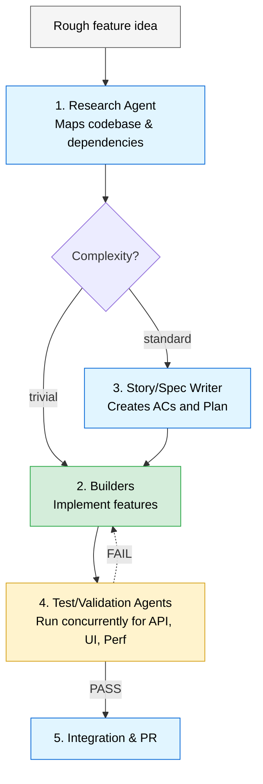

# Simplified Agent Orchestration Chain

This is a simplified view of how an orchestration chain decomposes and delegates complex features, derived from the core concepts in the Agent Hub Factory Chain.

## The Basic Orchestration Loop

Instead of one massive prompt, complex tasks are broken down so that specialized agents can work concurrently or sequentially as needed.

## Decomposing Layers

1. **Research (Sequential):** The first agent only maps the codebase and identifies bounded contexts. It does not write code.
2. **Builders (Parallelizable):** Once the schema and boundaries are established, Frontend and Backend builders can work in parallel on their isolated domains.
3. **Validation (Parallelizable):** API testing, UI testing, and Load testing (e.g., using `k6`) can run in parallel without blocking each other, provided they report to a single handoff summary.
