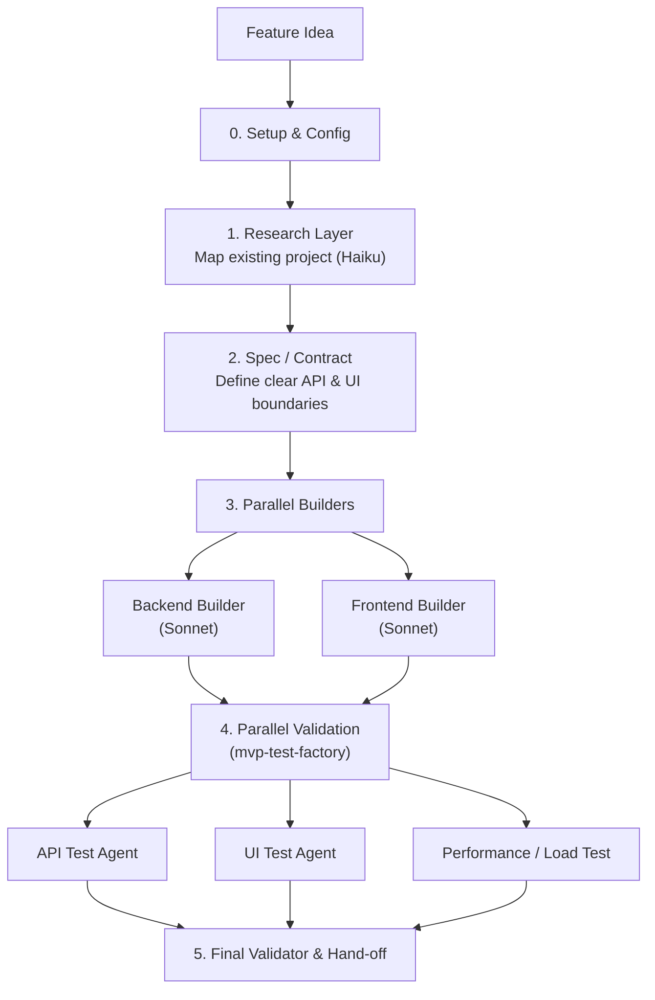

# Developer-Focused Factory Chain

This simplified orchestration chain uses a subset of the complete 7-agent factory chain, specifically optimized for hands-on developers leveraging `claude-helper`, `dev-workflow`, and `mvp-test-factory`.

## Layers of Decomposed Orchestration

### 1. Research Layer (Using Haiku)

The cheapest and fastest model (`Haiku`) maps the current state of the application. It looks for existing conventions, folder structures, and dependencies without modifying anything.
(Reference: [Model Selection Strategy](../rules/claude-credits/model-selection-strategy.md))

### 2. Specification & Contract

A human or a cheap agent writes the strict API boundaries and shared component definitions.

### 3. Development Workflow (`/dev-workflow`)

We move into the core development phase using the `sonnet` model. Because the contract was defined in step 2, the **Backend** and **Frontend** can be built simultaneously in parallel sessions or worktrees without causing merge conflicts.

### 4. MVP Test Factory (`/mvp-test-factory`)

Once the code is integrated, we spin up parallel validation agents to ensure the new feature is fully covered:

- **API Test Agent**: Asserts HTTP codes, response bodies, and error conditions.
- **UI Test Agent**: Leverages Playwright to ensure the user flow works end-to-end.
- **Performance Agent**: Ensures the app meets load requirements (e.g. using k6).

This modular approach ensures each agent has a single responsibility, avoiding the compounded context limits and silent errors common in single-session prompting.
