# Model Selection Guide

Comprehensive reference for choosing the right Claude model to optimize cost, speed, and quality when spawning agents.

## Available Models

| Model | Relative Cost | Speed | Use When |
|-------|--------------|-------|----------|
| **Haiku** (`haiku`) | 1x | Fastest | No reasoning needed |
| **Sonnet** (`sonnet`) | 3-5x | Medium | Code work, analysis |
| **Opus** (`opus`) | 15-20x | Slowest | Critical, complex decisions |

## The Core Principle

**Start with the cheapest model. Escalate only when needed.**

Haiku handles ~80% of agent tasks: file reads, searches, status checks, data extraction, simple formatting. If a task doesn't require writing code or deep reasoning, Haiku is the right choice.

### Model Selection Decision Tree

Use task risk and reasoning requirements to choose the initial model. When the task is unclear rather than purely mechanical, prefer Sonnet over guessing with Haiku.



[View the Mermaid source](diagrams/model-selection-decision-tree.mmd)

## Cost Decision Matrix

| Task Type | Model | Why |
|-----------|-------|-----|
| Read files | Haiku | No reasoning needed |
| Search/grep | Haiku | Pattern matching only |
| Git status/log | Haiku | Simple query |
| Parse data (JSON, CSV) | Haiku | Extraction, not analysis |
| Check build status | Haiku | Status lookup |
| Format/lint code | Haiku | Mechanical transformation |
| Write new code | Sonnet | Requires reasoning |
| Review code | Sonnet | Requires analysis |
| Debug issues | Sonnet | Requires investigation |
| Write tests | Sonnet | Requires understanding |
| Refactor (multi-file) | Sonnet | Moderate complexity |
| Architecture design | Opus | Critical decision |
| Security audit | Opus | Deep analysis required |
| Complex multi-system debug | Opus | High stakes, many variables |

## Cost-Saving Patterns

### Pattern 1: Right-Size Each Agent Call

```
# Exploring a codebase (3 steps)
Step 1: Find relevant files     → Haiku  (1x)
Step 2: Read and summarize them → Haiku  (1x)
Step 3: Analyze and fix a bug   → Sonnet (5x)
Total: 7x

# vs. using Sonnet for everything
Total: 15x  (2x more expensive)
```

### Pattern 2: Progressive Escalation

Start cheap, escalate only if the task proves harder than expected:
1. Try Haiku for exploration and data gathering
2. Use Sonnet for the actual code/analysis work
3. Reserve Opus for when Sonnet's output isn't good enough

Escalate when evidence shows that capability is the problem. If the failure came from missing context or unclear constraints, improve the evidence before retrying instead of immediately paying for a larger model.



[View the Mermaid source](diagrams/progressive-model-escalation.mmd)

### Pattern 3: Batch Reads with Haiku

When you need to read 10 files, 10 Haiku calls are still cheaper than 2 Sonnet calls — and faster due to Haiku's speed.

## Anti-Patterns

| Mistake | Why It's Bad | Fix |
|---------|-------------|-----|
| Sonnet for file reads | 5x cost for zero benefit | Use Haiku |
| Opus for simple bugs | 20x cost, no quality gain | Use Sonnet |
| Haiku for code generation | Poor output, wasted iterations | Use Sonnet |
| No model specified on agents | Defaults may be expensive | Always specify `model:` |

## Estimated Savings

With right-sized model selection (80% Haiku, 15% Sonnet, 5% Opus) vs. all-Sonnet:
- **~60-65% cost reduction** on agent calls
- **Faster responses** from Haiku's speed advantage
- **No quality loss** — each task gets the model it actually needs
