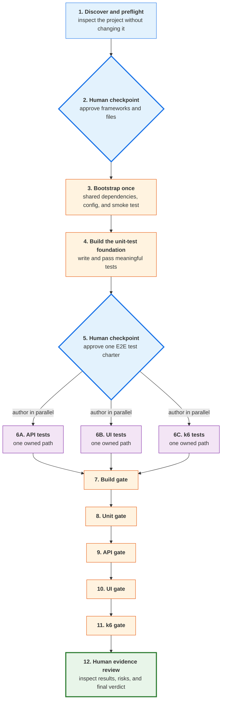

# MVP Test Factory Guide

`/mvp-test-factory` builds a real automated-test foundation for an MVP or prototype that has little or no testing. It does not add product features or repair product code. It adds approved test infrastructure, authors tests in bounded scopes, executes every required gate, and reports the evidence for human review.

## Why testing is orchestrated in phases

A testless project has shared setup that cannot safely be parallelized. Package manifests, lockfiles, test configuration, browser installation, server lifecycle, and root scripts need one owner. If API, UI, and performance workers all configure the project independently, they will overlap and may select incompatible tools.

The factory therefore uses this graph:



Test authoring can run in parallel when workers own separate paths and consume the same approved contract. Final execution is ordered because the suites may share a server, port, test data, and machine resources. The k6 gate runs after functional tests so load does not distort their evidence.

## Required tools

The target repository determines its runtime, package manager, and application commands. The reference Node workflow uses:

- Node.js and npm
- Vitest
- Playwright with Chromium
- Grafana k6
- Git

Install k6 before invoking the factory. Follow the official installation guide at <https://grafana.com/docs/k6/latest/set-up/install-k6/>. The factory verifies `k6 version` and stops before changing the project when the command is unavailable.

## Invocation

```text
/mvp-test-factory
/mvp-test-factory /absolute/path/to/project
```

Start from a clean Git working tree. The factory will not stash, reset, clean, commit, or discard existing work. It creates `claude-agents-output/mvp-test-factory-<project>/` only after the read-only environment preflight passes and records approved paths in `run-state.md`. A later invocation can resume only when the base commit matches and every change belongs to the recorded state or approved paths. Final ownership checks report the exact state directory separately from generated project files.

## Human checkpoints

### Framework and scope approval

Before installation, review:

- detected stack and package manager
- existing test layers and results
- exact dependency versions
- files and scripts to add or modify
- unit-test target
- API, UI, and performance ownership
- application start and readiness commands

Reject or revise anything that conflicts with team conventions.

### Test charter approval

Before parallel authoring, review the routes, selectors, dummy data, expected behavior, performance profile, ownership boundaries, and targeted commands. All workers use this charter as their binding contract.

### Final evidence review

A final PASS requires real execution of build, unit, API, UI, and k6 stages. A skipped, synthetic, pending, reused, or unexecuted result cannot satisfy a required gate.

## Password Strength Checker reference

The reference application is <https://github.com/kpassoubady/password-strength-checker>. Its `main` branch intentionally contains no automated tests so a new clone represents a realistic MVP starting point.

The application has useful testing seams:

| Layer | Real target |
|---|---|
| Unit | Deterministic password evaluator |
| API | `POST /api/check-password`, `GET /api/status`, and `GET /api/health` |
| UI | Password input, strength label/bar, feedback list, and visibility toggle |
| Performance | In-memory `POST /api/check-password` request path |

Clone it into a disposable learning directory rather than running the factory in a working copy that contains changes:

```bash
git clone https://github.com/kpassoubady/password-strength-checker.git
cd password-strength-checker
npm run install:server
k6 version
```

Then invoke `/mvp-test-factory` with the clone path.

### Proposed reference stack

At the first checkpoint, the expected proposal is:

- Vitest for evaluator unit tests
- `@playwright/test` for API and browser E2E tests
- Chromium for browser execution
- the installed k6 binary for a bounded local smoke test
- npm-managed root development dependencies and lockfile

The learner must approve the actual versions and file changes shown by the factory.

### Expected generated ownership

```text
Shared bootstrap owner
  package.json
  package-lock.json
  playwright.config.ts
  tests/unit/evaluator.test.ts

API worker
  tests/e2e/api/**

UI worker
  tests/e2e/ui/**

Performance worker
  tests/performance/**
```

The shared bootstrap completes before the three workers start. Workers cannot modify manifests, lockfiles, shared configuration, application source, or another worker's tests.

### Reference unit behavior

Meaningful evaluator tests should cover score boundaries from 0 through 4, strength/color mappings, actionable suggestions, empty input, and threshold lengths. They assert current public behavior and must pass before E2E work starts.

### Reference API behavior

API tests should exercise public HTTP routes and include:

- readiness and status responses
- weak and very strong fixed dummy inputs
- required response fields
- missing or non-string password returning HTTP 400

Do not test controller or evaluator internals through the API suite.

### Reference UI behavior

UI tests should use stable labels and IDs rather than Bootstrap layout classes. They should cover:

- initial and reset state
- debounced weak and strong results
- label, progress, and feedback changes
- password visibility toggle

The page loads Bootstrap from a CDN, but its functional JavaScript is inline. The UI suite should block the CDN requests so behavior testing does not depend on external network access.

Use only named dummy passwords. Never type a real password into the reference application during testing.

### Reference performance behavior

The k6 worker creates a short local smoke test, not a capacity or stress test. It checks response status and shape during load and applies approved error-rate and response-time thresholds. The final report must describe those thresholds as local safeguards and must not infer production capacity from laptop results.

A cross-platform Node wrapper starts the application, polls `/api/health`, invokes k6, propagates its exit code, and terminates only the server process it started.

## Failure handling

| Failure | Factory response |
|---|---|
| Dirty working tree | Stop before edits |
| Missing k6 | Stop before edits |
| Existing tests fail | Stop and report the baseline |
| Dependency or browser install fails | Stop with the real command and error |
| Generated test fails | Return to its owning writer, then rerun gates |
| Product behavior appears defective | Preserve evidence and ask for a separate product-fix decision |
| Worker changes an unowned path | Fail the ownership gate |
| Gate cannot execute | Overall BLOCKED, never PASS |

Each generated-test repair is capped at three total attempts. The factory does not weaken assertions or performance thresholds merely to obtain green output.

## Applying the pattern to another MVP

The password checker is an example, not hardcoded behavior. For another project, the factory must detect and preserve:

- its package manager and lockfile
- existing test frameworks
- actual build and start commands
- public API and browser surfaces
- readiness mechanism
- source and test conventions

Reuse compatible tools instead of installing a competing framework. If the project needs production credentials, remote load, destructive test data, or source restructuring, stop and design a project-specific test environment before continuing.
